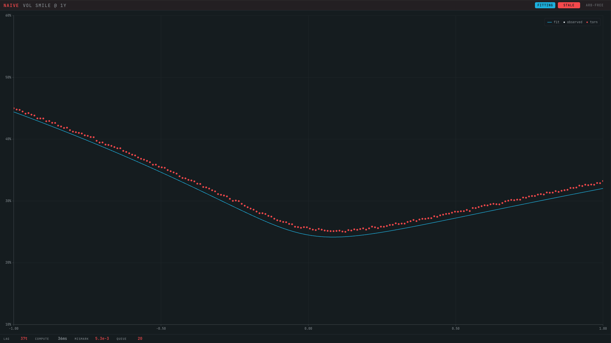
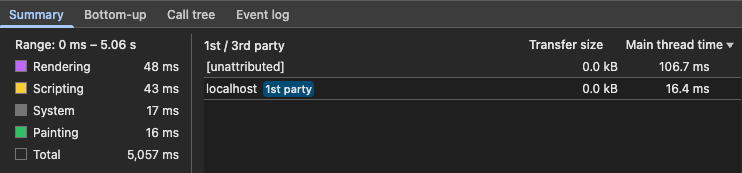
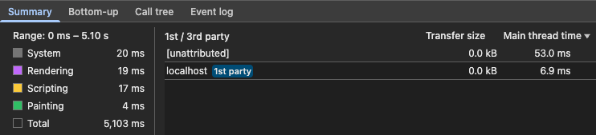
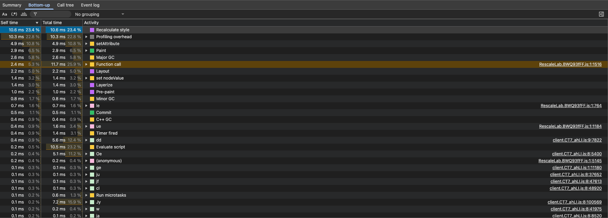

A chart that never holds still has two clocks. New data lands several times a
second and the plot redraws: in the rig I will use here, about 200 points and a
fitted curve at 5 Hz. Separately from that, the y-axis occasionally rescales when
the reader changes what it spans, and I want that rescale to glide rather than
jump.

<figure class="fig">



<figcaption>A chart with 200 dots and a fitted curve.</figcaption>

</figure>

So two things happen on the same element at once: a transform animation (the
rescale) and a high-frequency content update (the redraw). I spent a while
convinced the hard part was keeping the animation cheap while the redraw kept
firing. I built a rig to measure it. The cost was somewhere I had stopped
looking.

More precisely than the title lets on: in this workload, a compositor-driven
transform stays cheap even while the chart redraws at 5 Hz, and the two layout
costs I braced for measured as nothing. The bill was the redraw itself.

## The naive rescale: interpolate on the main thread

The obvious way to animate a range change is to interpolate it yourself. On each
`requestAnimationFrame`, compute an intermediate range and re-render the chart at
it. It works, and it looks smooth.

It also runs the entire animation on the main thread. Every frame recomputes the
scales and rebuilds the plot, which is the same redraw cost you already pay at
5 Hz, now paid at 60 Hz for the length of the transition. For that window the
animation competes for the main thread with the very updates it is animating
over.

Measurements come from a production-built Chrome rig reproducing the workload of the [live demo](https://demo.oracaus.dev) (a
single SVG group of moving nodes plus the transform animation, no CPU throttling).
Each figure below is total main-thread time accumulated over a five second trace,
not a per-frame or per-second number:

```text title="5 s window · ~200 nodes · production build · no throttle"
                      Scripting   Rendering   Painting   ~main thread
rAF (per-frame)         43 ms       48 ms       16 ms       ~107 ms
WAAPI (compositor)      17 ms       19 ms        4 ms        ~40 ms
```

## The fix: hand the transform to the compositor

The rescale is, geometrically, a pure transform. Re-render the content at the
*new* range immediately, then animate a `translateY` and `scaleY` from the value
that makes the new layout *look like* the old range back to identity. Because
that animation touches only `transform`, the browser can run the interpolation
on the compositor:

```tsx title="the compositor handoff"
// yRange changed. Content is already re-rendered at the new range;
// animate the transform from "looks like the old range" to identity.
const sy = (newMax - newMin) / (oldMax - oldMin);
const ty =
  MARGIN.top * (1 - sy) + (innerH * (oldMax - newMax)) / (oldMax - oldMin);

group.animate(
  [
    { transform: `translateY(${ty}px) scaleY(${sy})` },
    { transform: "translateY(0px) scaleY(1)" },
  ],
  { duration: 300, easing: "cubic-bezier(.4, 0, .2, 1)", fill: "forwards" },
);
```

<figure class="fig">


<figcaption>The compositor handoff.</figcaption>

</figure>

No per-frame React render, no scale recompute. The two keyframes are pure
`transform`, which the compositor can interpolate on its own thread. The main
thread hands off once and goes quiet: main-thread time over the trace falls from
the naive approach's 107 ms to about 40 ms, a 2.7x reduction. The picture on
screen is identical; what dropped is main-thread work, not a jump in frame rate.
In the trace the transition shows up in the Animations lane, the compositor
driving it, while the main thread carries only the 5 Hz baseline. That is the
whole, real result.

<figure class="fig">



<figcaption>rAF: Scripting 43, Rendering 48, Painting 16 ms; ~107 ms on the main thread.</figcaption>

</figure>

<figure class="fig">



<figcaption>WAAPI: Scripting 17, Rendering 19, Painting 4 ms; ~40 ms.</figcaption>

</figure>

The absolute figures are small because this workload is modest. What matters is
where the work lands and how it scales: on the main thread, cost grows with redraw
frequency and node count. On the compositor, the animation is largely independent of both.

## What I expected to cost, and didn't

Both of the things I was braced for are versions of the same worry: the browser
quietly redoing layout, the pass that works out where every element sits, on each
one of those 5 Hz frames. On a hot path that is exactly the kind of cost that
hides. I was confident enough about both to have written them into my own code
comments as established fact, and I built the rig partly to catch them in the act.
Neither showed up.

**The forced reflow.** Layout is normally batched: your code can change a hundred
things and the browser works out the new geometry once, just before it paints. But
the moment your code *reads* a geometry value back (an element's position or size),
the browser has to stop and compute layout right then. That synchronous, on-demand
layout is a forced reflow, and on a hot path it is a classic offender. The
CSS-transition arm of the benchmark includes one: it commits the start state with a
geometry read before the transition begins. I expected that read to be a tax on
every transition, worse while the chart was also redrawing.

It is not, and the reason is specific. The thing being animated is a `transform`,
which the browser resolves on the compositor without touching layout. So when the
code forces the read, the transform has dirtied no layout; the read just pulls
forward the layout the redraw would do that frame anyway. It reorders work, it does
not add it. The two arms come out indistinguishable: 2.5 ms of layout against
2.2 ms over five seconds. A forced reflow only bites when it makes layout run
*twice* (read, change something that invalidates layout, read again). This one runs
it once.

<figure class="fig">


<figcaption>Forced reflow: expected two passes, measured one.</figcaption>

</figure>

**The transform-box trap.** When the browser scales or moves an element, it does so
around a reference box, and the `transform-box` property picks which box that is.
One value, `fill-box`, ties it to the element's own bounding box, the rectangle
wrapping its current contents. Next to a constant redraw, that looked like a trap:
if the box wraps content that shifts every frame, the box shifts too, and surely
the browser must re-resolve the transform against it each time, layout on every
redraw.

To give that the best chance to show, I built a version whose bounding box
deliberately changes every tick, at 400 nodes. It stayed flat. `fill-box` against
`view-box`, box moving or held still, made no measurable difference to layout or
style recalc. The mechanism was plausible. The browser simply does not do the work
I pictured. (`view-box` is still the right setting in the real code, but for the
`transform-origin` maths, not for performance.)

## Where the cost actually is

With the animation accounted for and the two suspected costs ruled out, the trace
points somewhere flat and unglamorous. The dominant per-redraw cost is
`setAttribute` and Recalculate style, together around a third of main-thread time:
mutating a couple of hundred SVG nodes' geometry five times a second, and the
style invalidation that follows. It is identical across every arm, because it has
nothing to do with how the rescale is animated.

<figure class="fig">



<figcaption>One redraw, bottom-up: setAttribute and Recalculate style dominate, layout ~5% ('Profiling overhead' is DevTools, not the page).</figcaption>

</figure>

Once the animation is on the compositor, further gains come from cutting redraw
work, not from polishing the transition. That is the lever: fewer nodes, batched
attribute writes, a different rendering substrate. Not the animation, which was
already free, and not `transform-box`, which was never doing what I thought.

## What I would take from this

Compositor-only is the right instinct, and it paid off: the rescale belongs on
the compositor, and moving it there reduced main-thread work from about 107 ms to
40 ms over the trace. The standard advice to animate `transform` and `opacity` and
keep work off the main thread holds. But the two costs I was sure about either
reorder into nothing or never fire, and the one that dominates is the plain one I
had stopped looking at: SVG mutation and style recalculation, roughly a third of
main-thread time, untouched by anything I did to the animation.

A plausible mechanism and a measured cost are different things. Only the trace
tells you which is which.

## Notes

Under `prefers-reduced-motion: reduce` the animation runs with `duration: 0`,
snapping to the final state: the motion is a visual aid, not load-bearing. A
rescale that arrives before the last one finishes cancels the in-flight animation
and starts fresh, and the animation is cancelled on unmount, which keeps it
correct under React's double-mount in development.

The [MDN Web Animations API reference](https://developer.mozilla.org/en-US/docs/Web/API/Web_Animations_API)
covers the `Element.animate` handoff used here.
