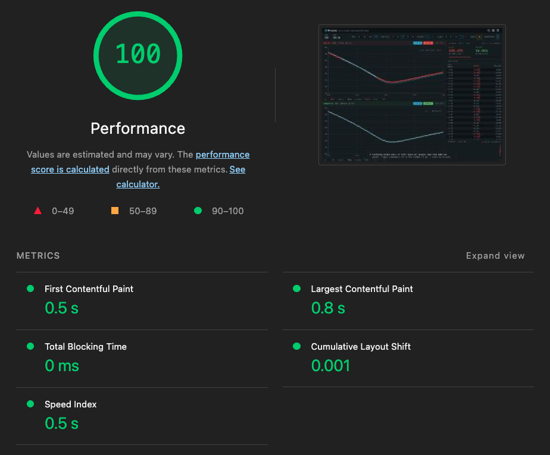
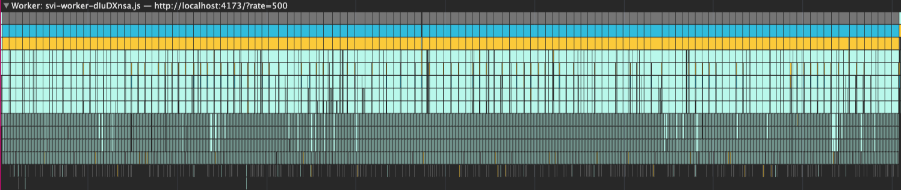

The dashboard came up in under a second, and every loading number was green. None
of that was the problem. Once the feed went live, with a vol-surface fit recomputing
on every tick, the chart began to stutter and lag.

That is a different kind of problem, and you find it a different way. A load audit
runs once and hands you a score; this you profile, by driving the UI under its real
workload and reading the trace. The hard part is knowing what to read. By the end of
this post you will know, for each way a real-time UI comes apart under load, exactly
where to look in DevTools and which number matters.

<aside class="callout callout-info">
  Load is not run-time. Loading is the cost of coming up; run-time is the cost of
  staying responsive while the data keeps arriving.
</aside>

## Performance isn't one speed

Inside the run-time regime, "is it fast?" stops having one answer. A live UI is
governed by three independent rates that keep competing long after load completes.
They are a producer, a transformation, and a presentation; in a browser UI they show
up as input, compute, and render.

<aside class="callout callout-info">
  Performance is governed by competing rates, not a single speed. The diagnostic
  unit is not time; it is the relationship between three rates.
</aside>

<figure class="fig">

<figcaption>
  Run-time failures are mismatches between competing rates, not a single measure of
  speed. Numbers from the demo (npm run bench), where a fast feed genuinely outruns
  the fit.
</figcaption>

</figure>

Used this way, the model is a procedure, not a taxonomy. Performance debugging is
relationship debugging: you are not measuring one speed, you are finding the two
rates whose relationship has broken down. The procedure is the same every time.

1. Identify the input rate.
2. Identify the compute rate.
3. Identify the render rate.
4. Find the pair that is out of step.
5. Measure that mismatch.
6. Narrow the class of likely fixes.

The rest of this post runs that procedure once per mismatch: every diagnosis below is
these six steps applied, with the DevTools surface and the number for each.

## You profile it, you don't audit it

A page-load audit works because loading is predictable: every user loads the same
bytes the same way, so one automated pass characterises it. Run-time is the
opposite. The expensive work is triggered by what the user and the feed do, it is
specific to your workload, and it sits on no single path. You do not audit it; you
drive the actual scenario, open the chain, fire the vol shock, drag the slider, and
record a Performance trace while it runs. That is closer to end-to-end testing than
to a one-shot audit.

This is the honest place for Core Web Vitals. They are very good at the regime they
were built for, the pay-per-load web where a faster load lifts revenue, and they stop
here by design. Even Interaction to Next Paint (INP), the closest of them, times a discrete
interaction; a feed
that drives a chart on its own fires none. There is no run-time metric in that
toolkit because a workload-specific cost generally has to be profiled under
representative load, not captured by a single generic pass.

<figure class="fig">

<figcaption>
  The load audit on the demo: a perfect Performance score, and silent about
  run-time. LCP 0.8 s, TBT 0, CLS 0.001. True, and not the question this post
  asks.
</figcaption>

</figure>

Read the three rates directly from the trace:

- **Input:** instrument it, or take the feed's tick rate (a `performance.mark` per event). It is a range, not a number: read it during a vol event, not a calm market, or you measure the easy case.
- **Compute:** the task's p99 duration on the Main or Worker track, not the mean, and a range too. The same fit runs faster on your dev box than on a trader's locked-down laptop or a VDI session, so a local p99 is an optimistic floor, not the number every desk sees.
- **Render:** the commit and frame cadence, from the Frames track and React's Profiler.

Once you can see all three, the failures are the gaps between them.

I will show each gap, and beside it what correct looks like, from
[demo.oracaus.dev](https://demo.oracaus.dev), which fits a fifty-expiry surface to a
streaming chain and stays smooth doing it. Its trace under the worst case is the
reference for healthy: a near-idle main thread with the feed running hot.

<figure class="fig">

<figcaption>
  The same UI profiled under a 500 Hz feed with a vol shock running: the main
  thread is busy about a quarter of the 5.07 s window, idle the rest, and the
  Frames track is clean. This is the reference for healthy.
</figcaption>

</figure>

## The method on one screen

Here is the whole method at a glance. The rest of the post is one row at a time, with
the DevTools steps and the healthy trace for each.

| You see | Rates | Look here | Measure | Likely fix |
| --- | --- | --- | --- | --- |
| renders far exceed paints; work thrown away | input > render | React Profiler commits; Main track | commits/sec vs frames/sec | subscribe once, commit at display cadence |
| data lagging, queue growing | input > compute | Worker/Main track; User Timing; queue depth | compute p99 vs inter-input interval | coalesce to the latest input |
| output doesn't match the input shown (correctness) | compute latency > inter-input gap | on screen; coherence metric | compute p99 vs interval | commit input and output as one snapshot |
| stutter, dropped frames | work per frame > budget | Frames track; Main flame; Performance Monitor | p99 frame time, dropped frames, layouts/sec | move compute off-thread; compositor, cut redraw, cut allocation |

## Re-rendering faster than you paint

**Symptom.** The component re-renders on every input event, far more often than the
screen repaints. Most of that work is thrown away before anyone sees it. It is worse
than waste: those renders run on the main thread, so they help starve the next frame,
feeding the dropped-frame failure below.

<figure class="fig">

<figcaption>
  Renders fire at the feed rate; only the three that land on a paint survive. The
  rest is thrown away.
</figcaption>

</figure>

**Look here.** Open React DevTools, switch to the Profiler, and record while the feed
runs. If it reports that profiling is not supported, the build stripped the
instrumentation: profile a development or profiling build instead (for React, the
`react-dom/profiling` entry, which stays minified and production-representative). A
naive component shows one commit per tick, a dense picket fence of bars; in the
Performance panel, the same work packs the Main track between paints.

**Measure.** Commits per second against frames actually painted. If commits run at the
feed rate while the screen paints at 60 or fewer, the difference is pure waste.

**Healthy.** Commits track the display cadence, not the feed's, and that cadence can
sit well below the screen's paint ceiling. Profiled against a 500 Hz feed, the demo
commits at its 5 Hz display throttle, not 500, each commit a median 0.1 ms of React
work.

**Likely fix.** Stop driving renders at input rate: subscribe to the feed once and let
the UI commit at its own cadence, rather than threading every tick through props.

## Compute falling behind the feed

**Symptom.** Results lag the feed, and under load the lag grows. What is on screen is
several ticks old, and getting older.

<figure class="fig">

<figcaption>
  Each fit outlasts several ticks, so its result is stale on arrival; without
  coalescing, the lag grows.
</figcaption>

</figure>

**Look here.** Open the Performance panel, record under load, and find the compute
task on the Main track, or the Worker track if you moved it off-thread; read its
duration. Bracket it with User Timing, a `performance.mark` at the input and a
`performance.measure` at the result, to put an input-to-result latency on the Timings
track. If you queue inputs, instrument the queue depth: a growing queue is the tell.

**Measure.** Compute p99 against the inter-input interval. If a fit takes longer than
the gap between ticks, you cannot keep up tick-for-tick; either the queue grows
without bound, or you coalesce.

**Healthy.** Input-to-result latency stays bounded and queue depth does not trend
upward: the fit runs back to back with no widening gap.

<figure class="fig">

<figcaption>
  Full-surface fits run back to back on the worker thread, each a median 40 ms
  (about 58 ms at p99) with no widening gap. Off the main thread, so a fit that
  outlasts a frame never blocks one.
</figcaption>

</figure>

**Likely fix.** Coalesce: absorb the intermediate inputs and compute against the
latest. This is backpressure's lossy path, keep the newest and drop the rest, so you
stay one result behind instead of falling endlessly further back.

## The answer that no longer matches the input

You reach this one by fixing the others. Move heavy work off the main thread so it
stops blocking frames, and once it is async its result can land against an input that
has already moved, a correctness problem the runtime alone cannot solve. And you
cannot tune your way out of it: input rate climbs with volatility and compute time
climbs on slower hardware, so on a busy feed or a slow machine the compute loses the
race, however fast it is on your own box. The answer has to be structural, not a
faster fit.

**Symptom.** The output on screen is paired with an input it was never computed from,
a frame that was never true. In the demo, the fitted curve pulls off the quotes it was
built from.

**Look here.** Not in the flame chart. You see it on screen, the fitted curve pulling
off the quotes it was fit to, or you catch it with a coherence metric. The timing
precondition, though, is visible: the compute taking longer than the gap between
inputs.

**Measure.** Compute p99 against the inter-input interval (the precondition), and a
coherence check: does the output on screen match the input on screen.

**Healthy.** The output on screen always matches the input on screen: every pair is
committed from the one snapshot it shares.

**Likely fix.** Commit the input and its output together as one snapshot. This is the
one failure the profiler cannot show you; I took it apart in full in
[its own post](/blog/useeffect-abortcontroller-tears).

## A frame that misses its budget

**Symptom.** The visible jank: stutter, dropped frames, a frame rate that sags and
spikes.

**Look here.** Open the Performance panel and record under load; the Frames track
flags long and dropped frames, and clicking one opens the Main track flame chart
showing where the time went, scripting, style recalculation, layout, paint. For
a live read, open the Performance Monitor (press Cmd+Shift+P, or Ctrl+Shift+P on
Windows, and run "Show Performance Monitor"), then enable CPU usage, Layouts per second,
Style recalculations per second, and JS heap size; it plots them live as the feed runs,
which a single trace cannot.
The Rendering tab's Frame Rendering Stats overlays live frame rate on the page itself.

**Measure.** Read the worst frames, your p99, and the dropped-frame count straight
from the Frames track; the long tasks (over 50 ms, marked with a red corner) on the
Main track; and layouts-per-second live in the Performance Monitor. The mean frame
time will look fine; it is the worst frames the user feels.

**Healthy.** Frames stay inside budget, the main thread runs no long tasks and sits
idle between paints, and the redraw cost stays flat rather than climbing.

<figure class="fig">

<figcaption>
  Under the hot feed the monitor holds steady: the JS heap sawtooths between
  roughly 50 and 95 MB without trending up, DOM nodes flat near 3,100, CPU around a
  quarter. Layouts and style recalculations hold in the single digits, peaking near
  10 a second, never thrashing or climbing. No memory leak, no node leak.
</figcaption>

</figure>

**Likely fix.** It depends on which part of the frame is heavy. If it is scripting, a
synchronous computation blocking the main thread, move it off-thread, usually into a
worker; that is the compute failure above, surfacing as jank. If it is the rendering
itself: move the animation to the compositor
([covered here](/blog/compositor-animation-chart-performance)), cut the redraw work or
drop to canvas, or kill the allocation the garbage collector is paying for.

## Where this comes from

I did not assemble this from blog posts; I learned to read these traces on trading
desks, in FX, rates and derivatives, where a frame that lies is a mispriced quote. The
pieces are old and not mine alone: [Nolan Lawson](https://nolanlawson.com/2021/02/23/javascript-performance-beyond-bundle-size/) on main-thread cost, the
reactive-streams world on backpressure, the React team on concurrent rendering, the
game world on frame pacing. What I am adding is one repeatable procedure for reading
them: find the relationship that is breaking down.

## Try it on your own UI

You can put this to work in a few minutes, without any of my code. Take a real-time UI
of your own, drive its worst scenario, and record a Performance trace while it runs,
not while it loads.

<aside class="callout callout-info">
  Run-time performance is governed by competing rates, and a janky real-time UI is a
  mismatch between two of them. It answers a different class of question from your
  loading metrics, not a replacement for them.
</aside>

Find the input. Find the compute. Find the render. Find the relationship that is
breaking down. That tells you where to look next.
